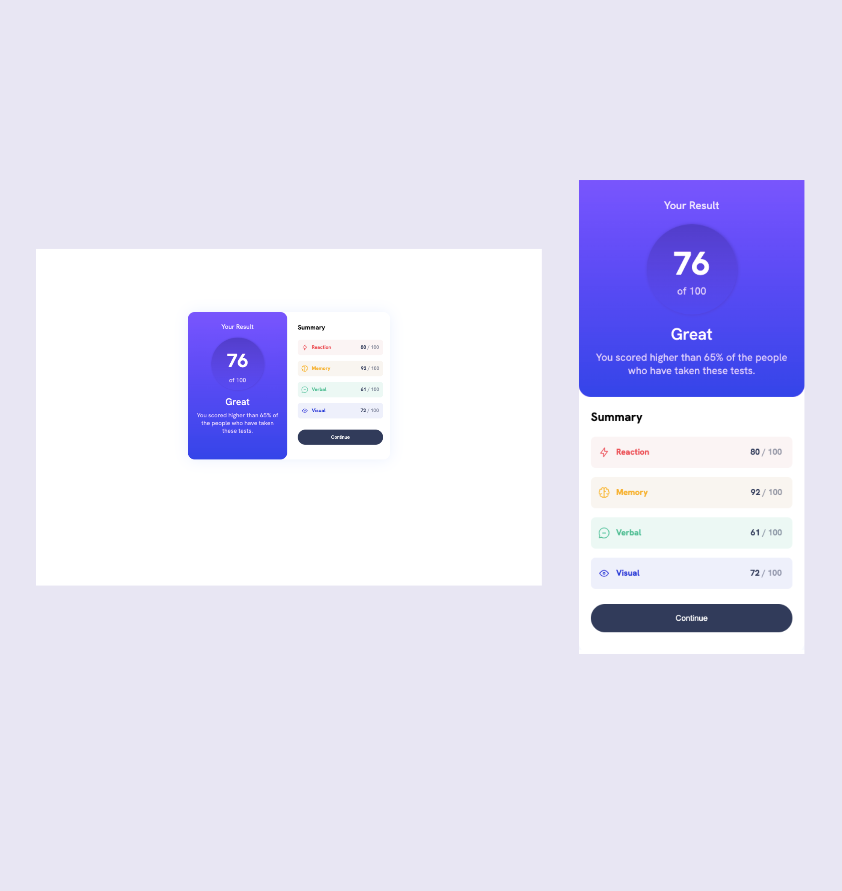

# Frontend Mentor - Results summary component solution

## Table of contents

- [Overview](#overview)
  - [The challenge](#the-challenge)
  - [Screenshot](#screenshot)
  - [Links](#links)
- [My process](#my-process)
  - [Built with](#built-with)
  - [What I learned](#what-i-learned)
  - [Continued development](#continued-development)
- [Author](#author)
- [Acknowledgments](#acknowledgments)

## Overview

### The challenge

Users should be able to:

- View the optimal layout for the interface depending on their device's screen size
- See hover and focus states for all interactive elements on the page

### Screenshot




### Links

- Solution URL: [Check out my solution](https://www.frontendmentor.io/solutions/results-summary-component-iHQHi0pDb7)
- Live Site URL: [Check out my live site](https://omowunmikamil.github.io/results-summary-component.github.io/)

## My process

### Built with

- Semantic HTML5 markup
- CSS custom properties
- Flexbox
- CSS Grid
- Mobile-first workflow (Responsive Mobile)

### What I learned

```html
<h1>Some HTML code I'm proud of</h1>
<h2></h2>
<p></p>
<main></main>
<section></section>
<div class="cycle"></div>
<span></span>
<svg></svg>
<button class="btn">Continue</button>
```
```css
body {
  background-color: var(--white);
  font-size: var(--font-size);
  font-family: var(--font-family);
}

#container {
  display: flex;
  justify-content: center;
  align-items: center;
  background-color: var(--white);
  width: 40%;
  margin: 10em auto;
  box-shadow: 0 1px 40px 0 var(--pale-blue);
  border-radius: 20px;
}

.left {
  background-image: linear-gradient(180deg, var(--light-slate-blue), var(--light-royal-blue));
  height: 420px;
  width: 50%;
  padding: 20px;
  text-align: center;
  border-radius: 20px;
}

.left h2:first-child {
  font-size: 1em;
  margin-top: 10px;
  color: var(--white);
  opacity: 90%;
}

.left .cycle {
  background-image: linear-gradient(180deg, var(--violet-blue), var(--persian-blue));
  width: 150px;
  height: 150px;
  border-radius: 100px;
  box-shadow: 1px 0 6px 0 var(--violet-blue);
  margin: 20px auto 15px;
  padding: 30px;
  color: var(--white);
}

@media screen and (max-width: 375px) {
    #container {
        display: flex;
        flex-direction: column;
        width: 100%;
        margin: 0;
    }
}
```

### Continued development

Mobile Responsiveness

## Author

- Website - [Visit my Portfolio Website](https://omowunmikamil.tech)
- Frontend Mentor - [Omowunmi Kamiludeen](https://www.frontendmentor.io/profile/Omowunmikamil)
- Twitter - [Browser_Nerd](https://www.twitter.com/@Browser_Nerd)

## Acknowledgments

- **Frontend Mentor** - for providing README and style guide file to help bring this amazing project to life